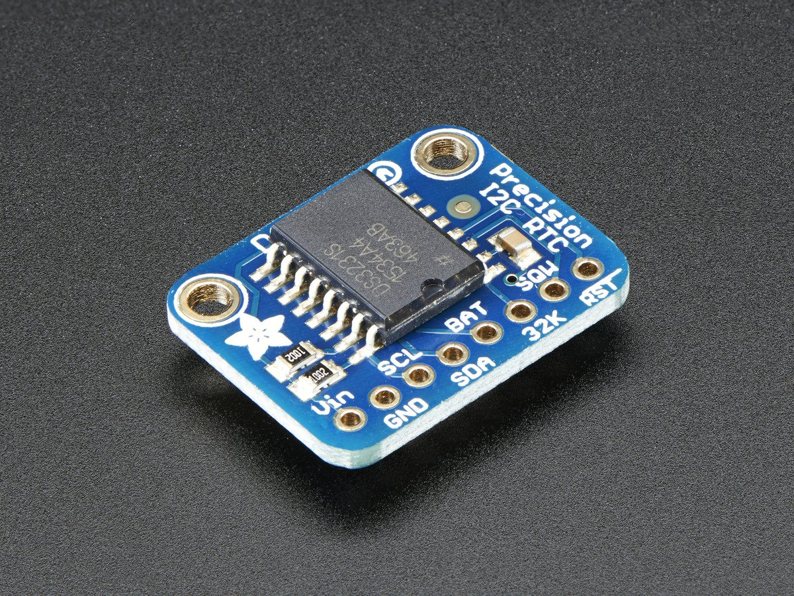

# rpi-ds3231
This repo contains a description of working with the DS3231 real time clock for the Raspberry Pi.

I've used the DS1307 in the past and found the time would drift significantly, especially in high heat situations.  Furthermore, the DS1307 would often reset if the battery was bumped or if the voltage waivered even slightly.  Therefore, I've tried the DS3231, which has performed much better. 

Much of the information below comes from [this page](https://spellfoundry.com/sleepy-pi/setting-up-the-real-time-clock-on-raspbian-jessie/), this [discussion](https://www.raspberrypi.org/forums/viewtopic.php?f=66&t=125003) and this [blog](https://trick77.com/adding-ds3231-real-time-clock-raspberry-pi-3/).



## Real-Time Clock Setup

Insert a 3v battery ([CR1220](https://www.adafruit.com/product/380)) and connect the DS3231 to the RPi via I2C bus.  

### I2C Setup
Make sure you've installed and enable the appropriate I2C tools:

```
sudo apt-get install i2c-tools
```

and edit the ```/boot/config.txt``` file by uncommenting ```dtparam=i2c_arm=on``` and
adding the following line at the bottom:

```
dsoverlay=i2c-rtc,ds3231
```

I've not used other RTCs but Im guessing you can substitute the ```ds3231``` for other available RTCs.  **Reboot**.

To confirm you're connected via I2C, run:

```
$ i2cdetect -y 1
```

### RTC Configuration
Next you'll need to remove the fake hardware clock.  I dont understand this but run these commands:

```
$ sudo apt-get -y remove fake-hwclock
$ sudo update-rc.d -f fake-hwclock remove
```

I've also seen people use:

```
$ sudo apt-get purge fake-hwclock
```
but I'm not too sure what the difference is.

Next we'll edit the file ```/lib/udev/hwclock-set```.  This file Comment out these lines:

```
#if [ -e /run/systemd/system ] ; then
# exit 0
#fi
```
and the lines with ```--systz```.  These lines will update the RTC from the system time, which is something we dont want:

```
if [ yes - "$BADYEAR" ] ; then 
#  /sbin/hwclock --rtc=$dev --systz --badyear
  /sbin/hwclock --rtc=$dev --hctosys --badyear
else
#  /sbin/hwclock --rtc=$dev --systz --badyear
  /sbin/hwclock --rtc=$dev --hctosys
fi
```

Finally, edit the file ```/etc/rc.local``` and add:

```
/sbin/hwclock -s
```

above the last line ```exit 0```.  This will cause the hwclock to update the system time each time on reboot.

## Useful Commands

```
# Write to Rpi time to hwclock
sudo hwclock -w

# Read hwclock
sudo hwclock -r

# Set RPi time from hwclock
sudo hwclock -s

# Set Rpi time
sudo date -s "Thu Apr 10 20:15:00 2018"

# Set hwclock time
sudo hwclock -s "Thu Apr 10 20:14:00 2018"

# Check the clocks
timedatectl status
```
